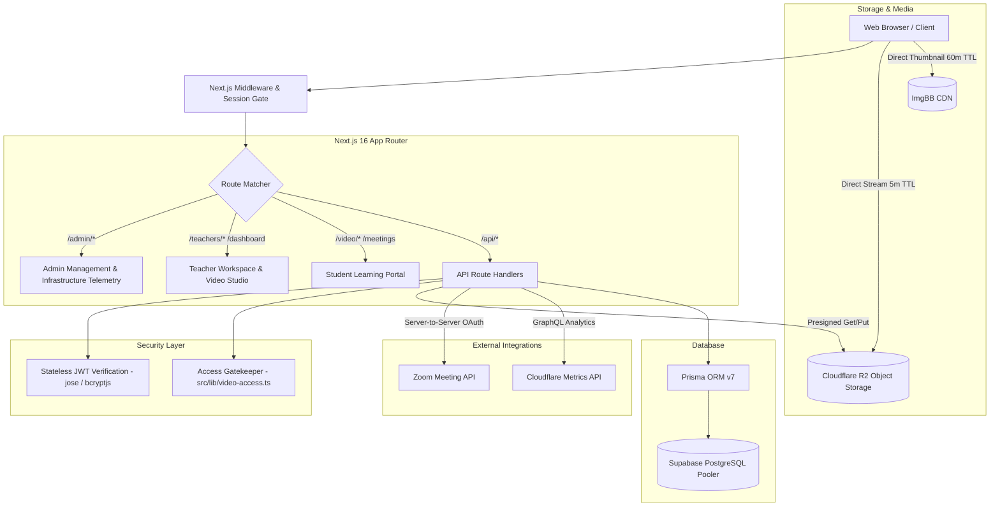

<div align="center">
  
  <h1>Lernio LMS</h1>
  <p><strong>A Next-Generation, Multi-Tenant Educational Learning Management System</strong></p>

  <p>
    <a href="https://nextjs.org/"></a>
    <a href="https://react.dev/"></a>
    <a href="https://tailwindcss.com/"></a>
    <a href="https://www.prisma.io/"></a>
    <a href="https://supabase.com/"></a>
    <a href="https://www.cloudflare.com/developer-platform/r2/"></a>
    <a href="https://zoom.us/"></a>
  </p>
</div>

---

## 📖 Overview

**Lernio** is an enterprise-ready, multi-tenant Learning Management System engineered specifically for educational academies, independent instructors, and tutoring institutions. Built on the bleeding edge of the React and Next.js ecosystem, Lernio provides high-performance video delivery with zero-trust security, automated live class scheduling via Zoom, fine-grained access control, and real-time infrastructure analytics.

---

## ✨ Core Capabilities

### 🔐 Multi-Tenant Role-Based Access Control (RBAC)
- **Super Administrator (`ADMIN`)**:
  - Full system sovereignty: onboard, audit, activate, or deactivate teachers.
  - Complete student lifecycle management: registration, subscription expiration, grade levels, and status tracking.
  - Organization-wide catalog management and global live class oversight.
  - Deep storage telemetry: real-time Cloudflare R2 bucket usage, Class A/B operation counts, bandwidth metrics, and cost projections.
  - Centralized Zoom Server-to-Server credential lifecycle.
- **Educator / Teacher (`TEACHER`)**:
  - Isolated multi-tenant workspace scoped strictly to the teacher's own assets.
  - Upload, organize, and publish video content directly to Cloudflare R2 with in-browser compression.
  - Schedule, launch, and manage live Zoom classes linked to private or institution Zoom accounts.
  - View assigned student rosters and curate custom video permissions per student.
  - Privacy-first storage capacity indicator (zero raw telemetry or cloud vendor exposure).
  - Strict guardrails: cannot create, mutate, or delete student profiles or inspect other instructors' classes.
- **Student (`STUDENT`)**:
  - Personalized learning dashboard delivering grade-targeted and custom-assigned video content.
  - Cinema-grade video player powered by `media-chrome` with playback controls, responsive quality, and timestamp bookmarks.
  - Secure video streaming backed by time-limited presigned URLs (no permanent public media links).
  - Live class schedule with automated one-click Zoom join links for upcoming sessions.
  - Collaborative learning with nested discussion comments, teacher feedback, and video reactions.
  - Automated validity gating: immediate access lock upon account expiration or deactivation.

---

### 🎥 High-Performance Video Pipeline & Storage
- **Direct Cloudflare R2 Streaming**: Videos and thumbnails are delivered via secure AWS S3 presigned URLs with short time-to-live (5-minute stream URLs, 60-minute thumbnail URLs), eliminating bandwidth leaks and unauthorized hotlinking.
- **Client-Side Video Compression**: Integrates WebAssembly-powered `@ffmpeg/ffmpeg` directly in the browser to transcode and compress lecture recordings before upload, minimizing storage consumption and upload times.
- **Interactive Thumbnails**: Built-in crop and preview workflow using `react-easy-crop` with automated uploads.
- **Granular Access Rules**: Content access is dynamically resolved combining student enrollment status, grade level compatibility (Grade 6–11), and custom video permissions.

---

### 📅 Seamless Zoom Live Class Integration
- **Server-to-Server OAuth**: Direct integration with Zoom's official REST API for automated meeting lifecycle management.
- **Multi-Account Support**: Associate dedicated Zoom credentials per teacher or leverage institution-wide shared credentials.
- **Intelligent Routing**: Teachers launch meetings with authenticated `start_url` credentials; enrolled students join with secure, teacher-scoped `join_url` deep links.

---

### 📊 Real-Time Storage Telemetry & Analytics
- **Live Cloudflare GraphQL Analytics**: Queries bucket storage volume, object counts, Class A (write/list) operations, Class B (read) operations, and estimated monthly billing.
- **Role-Sanitized Data Presentation**:
  - Admins receive full metrics, billing gauges, and operations charts.
  - Teachers receive a clean capacity meter (`Optimal`, `Moderate`, `Nearing Limit`, `Critical`) without exposing cloud infrastructure details.

---

## 🏗️ System Architecture



---

## 🛠️ Technology Stack

| Domain | Technology | Description |
| :--- | :--- | :--- |
| **Framework** | [Next.js 16](https://nextjs.org/) | App Router, Server Actions, Turbopack Bundler |
| **Frontend Runtime** | [React 19](https://react.dev/) | React Server Components, Actions, useActionState |
| **Design System** | [Tailwind CSS v4](https://tailwindcss.com/) & [HeroUI v2](https://heroui.com/) | Modern utility styling, accessible UI primitives, dark mode |
| **Icons & Media** | [Lucide React](https://lucide.dev/) & [Media Chrome](https://www.media-chrome.org/) | Vector icons & customizable accessible media players |
| **Database & ORM** | [PostgreSQL](https://postgresql.org/) & [Prisma ORM 7](https://www.prisma.io/) | Relational database hosted on Supabase with `@prisma/adapter-pg` |
| **Object Storage** | [Cloudflare R2](https://www.cloudflare.com/products/r2/) | S3-compatible, egress-free object storage with presigned URLs |
| **Live Conferencing** | [Zoom Video API](https://developers.zoom.us/) | Server-to-Server OAuth meeting provisioning |
| **Video Transcoding** | [`@ffmpeg/ffmpeg`](https://ffmpegwasm.netlify.app/) | In-browser WebAssembly video compression and encoding |
| **Authentication** | `jose` & `bcryptjs` | HTTP-only signed JWT sessions with zero external auth vendor lock-in |

---

## 📁 Repository Structure

```
lernio/
├── prisma/
│   ├── schema.prisma             # Database schema, relations, and indexes
│   └── migration.tenant.js       # Idempotent legacy tenant backfill migration
├── public/                       # Static public assets, logos, and icons
├── src/
│   ├── app/                      # Next.js App Router
│   │   ├── (dashboard)/          # Student & teacher learning layouts & views
│   │   ├── admin/                # Admin dashboards (teachers, users, videos, meetings)
│   │   ├── api/                  # 24 RESTful API routes
│   │   │   ├── auth/             # Login, logout, session identity (/me)
│   │   │   ├── meetings/         # Zoom meetings CRUD & student scheduling
│   │   │   ├── r2-metrics/       # Cloudflare R2 storage telemetry
│   │   │   ├── student/          # Student-specific endpoints (meetings, access)
│   │   │   ├── teachers/         # Teacher management endpoints (Admin only)
│   │   │   ├── users/            # Student management endpoints
│   │   │   ├── videos/           # Video streaming, thumbnails, likes, comments
│   │   │   └── zoom-accounts/    # Zoom S2S credential management
│   │   └── login/                # Authentication page
│   ├── components/               # Reusable UI & business logic components
│   │   ├── CloudflareR2Widget.tsx # Telemetry gauge (Admin analytics vs Teacher capacity)
│   │   ├── TeacherDashboardClient.tsx # Multi-tenant teacher portal
│   │   └── VideoPlayer.tsx       # Media Chrome streaming wrapper
│   ├── lib/                      # Core backend utilities
│   │   ├── db.ts                 # Prisma Client singleton
│   │   ├── jwt.ts                # JWT token signing, verification & cookie management
│   │   ├── video-access.ts       # Centralized access control matrix logic
│   │   └── zoom.ts               # Zoom S2S OAuth token fetcher & client
│   └── proxy.ts                  # Edge middleware session validation & redirection
├── .env.sample                   # Sample environment variable declarations
├── package.json                  # Dependencies and execution scripts
├── tailwind.config.ts            # Tailwind CSS styling configuration
└── tsconfig.json                 # TypeScript compiler specifications
```

---

## ⚙️ Getting Started

### 1. Prerequisites
- **Node.js**: `v20.x` or later
- **Package Manager**: `npm` (v10+), `pnpm`, or `bun`
- **Database**: PostgreSQL database (recommended: [Supabase](https://supabase.com/) with transaction pooler)
- **Object Storage**: [Cloudflare R2](https://dash.cloudflare.com/) account & API bucket tokens
- **Image Hosting**: [ImgBB](https://imgbb.com/) account API key (for thumbnails)
- **Live Video**: [Zoom Developer](https://marketplace.zoom.us/) Server-to-Server OAuth app

---

### 2. Installation

Clone the repository and install project dependencies:

```bash
git clone https://github.com/Danushka-Madushan/lernio.git
cd lernio
npm install
```

---

### 3. Environment Setup

Create your local environment file from `.env.sample`:

```bash
cp .env.sample .env.local
```

Populate the required environment variables in `.env.local`:

```env
# Database Connection (Supabase Transaction & Session Poolers)
DATABASE_URL="postgresql://postgres:[PASSWORD]@[HOST]:6543/postgres?pgbouncer=true"
DIRECT_URL="postgresql://postgres:[PASSWORD]@[HOST]:5432/postgres"

# Authentication
JWT_SECRET="generate-a-secure-random-string-minimum-32-chars"

# Cloudflare GraphQL Telemetry (For Admin Storage Widget)
CLOUDFLARE_API_TOKEN="your-cloudflare-analytics-api-token"

# Cloudflare R2 Video Storage (S3-Compatible)
CLOUDFLARE_R2_ACCOUNT_ID="your-cloudflare-account-id"
CLOUDFLARE_R2_ACCESS_KEY_ID="your-r2-access-key-id"
CLOUDFLARE_R2_SECRET_ACCESS_KEY="your-r2-secret-access-key"
CLOUDFLARE_R2_BUCKET_NAME="lernio-videos"
CLOUDFLARE_R2_PUBLIC_URL="https://your-custom-or-r2-subdomain.r2.dev"

# Thumbnail Image Hosting
IMGBB_API_KEY="your-imgbb-api-key"
```

---

### 4. Database Initialization

Generate the Prisma Client and synchronize database schema definitions:

```bash
# Generate the Prisma TypeScript client
npx prisma generate

# Apply schema migrations to your PostgreSQL instance
npx prisma db push
```

#### Legacy Tenant Backfill (Optional)
If migrating an existing database containing records prior to multi-tenancy support, associate orphaned videos, meetings, and zoom accounts with the primary administrator:

```bash
node prisma/migration.tenant.js
```

---

### 5. Running the Application

Start the local development server:

```bash
npm run dev
```

Visit [http://localhost:3000](http://localhost:3000) in your browser.

---

## 🔒 Security & RBAC Matrix

| Endpoint / Resource | Student | Teacher | Super Admin |
| :--- | :---: | :---: | :---: |
| **Browse / Watch Assigned Videos** | ✅ (If Active) | ✅ (Own Catalog) | ✅ (All) |
| **Stream Video via Presigned URL** | ✅ (Short-lived) | ✅ | ✅ |
| **Upload / Transcode New Videos** | ❌ | ✅ (Scoped) | ✅ |
| **Join Scheduled Zoom Classes** | ✅ (Assigned Teacher) | ✅ (Host) | ✅ |
| **Create / Delete Zoom Meetings** | ❌ | ✅ (Own Accounts) | ✅ |
| **View Student Roster** | ❌ | ✅ (Assigned Only) | ✅ (All) |
| **Create / Edit / Delete Students** | ❌ | ❌ | ✅ |
| **Manage Teacher Accounts** | ❌ | ❌ | ✅ |
| **Cloudflare Storage Analytics** | ❌ | ⚠️ (% Only, Unbranded) | ✅ (Full Metrics & Costs) |

---

## 🧪 Available Scripts

| Command | Action |
| :--- | :--- |
| `npm run dev` | Boots Next.js development server with hot-reloading |
| `npm run build` | Compiles production bundle with Turbopack and static optimization |
| `npm run start` | Launches compiled production server |
| `npm run lint` | Runs ESLint analysis across TypeScript & JSX files |
| `npx tsc --noEmit` | Runs full static TypeScript type checks across all code |
| `npx prisma studio` | Opens Prisma Studio GUI to inspect and manipulate database records |

---

## 🚀 Production Deployment

1. **Static Analysis & Build Verification**:
   ```bash
   npx tsc --noEmit
   npm run lint
   npm run build
   ```
2. **Deploy to Hosting Provider**:
   - Easily deploy to **Vercel**, **AWS Amplify**, or a self-hosted **Docker / Node.js** container.
   - Configure all environment variables in your deployment dashboard.
   - Ensure the server runtime has outbound network access to Cloudflare R2, Zoom API, and Supabase.

---

## 📄 License

This project is proprietary and confidential. Unauthorized copying, distribution, or commercial modification of files in this repository is strictly prohibited.
